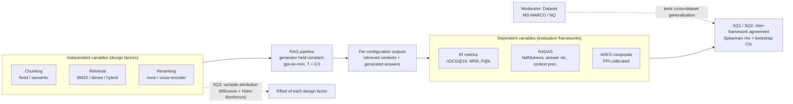

# Automated RAG Evaluation Frameworks: A Cross-Framework and Cross-Dataset Comparative Study
## MSc Dissertation
### Programme: MSc Data Science and Artificial Intelligence
### Institution: Gisma University of Applied Sciences
### Student: Dinesh (GH1040084) | Supervisor: William Morrison

---

## DECLARATION OF ORIGINALITY

I hereby declare that this dissertation is my own original work. It has not been submitted for any other degree or professional qualification, at Gisma University of Applied Sciences or elsewhere.

All sources of information have been properly acknowledged through in-text citations and a full bibliography. All experimental design, implementation, data analysis, and written content are my own. Where external tools, libraries, and frameworks have been used, these are clearly attributed in the methodology and references.

**Student Name:** Dinesh
**Student Number:** GH1040084
**Programme:** MSc Data Science and Artificial Intelligence
**Institution:** Gisma University of Applied Sciences
**Supervisor:** William Morrison
**Date:** 25 September 2026

---

## ACKNOWLEDGEMENTS

This dissertation was completed independently, and I take full responsibility for every decision made within it — the experimental design, the code, the analysis, and the writing.

I would like to express my sincere gratitude to my supervisor, William Morrison, whose guidance shaped this research at every stage. His feedback was direct and constructive — he pushed me to think more rigorously about methodology, to be honest about limitations, and to write with greater clarity and precision. Our meetings gave this work a direction I could not have found on my own.

I am grateful to Gisma University of Applied Sciences for providing the academic environment and resources that made this programme possible. The MSc Data Science and Artificial Intelligence has given me both the technical foundation and the research mindset to pursue questions I genuinely care about.

I would also like to acknowledge the open-source communities behind the tools this research depends on: the developers of RAGAS, BEIR, sentence-transformers, and the broader Hugging Face ecosystem. Without open, reproducible research infrastructure, work like this would not be possible for a single independent researcher.

This dissertation is proof to myself that it can be done — alone, from scratch, all the way through.

---

## ABSTRACT

Retrieval-Augmented Generation (RAG) systems are increasingly deployed in production settings where reliable automated evaluation is essential, yet three competing families of evaluation frameworks — traditional information retrieval (IR) metrics (nDCG, MRR, Precision@k), RAGAS (Es et al., 2024), and ARES (Saad-Falcon et al., 2024) — have never been systematically compared on the same experimental conditions or tested for whether their agreement generalises across datasets, a gap identified by Gan et al. (2025) and Brown et al. (2025). This dissertation addresses that gap through a fully reproducible experiment: twelve RAG configurations (2 chunking strategies × 3 retrieval methods × 2 reranking options) were evaluated on two BEIR-formatted datasets, MS MARCO and Natural Questions, using all three framework families, yielding 24 runs across 500 queries each, analysed with Spearman rank correlation and 10,000-iteration bootstrap confidence intervals (SQ1/SQ2) and Wilcoxon signed-rank tests with Holm–Bonferroni correction (SQ3). The central result is that inter-framework agreement depends critically on judge calibration: ARES composite scores were calibrated against 200 human-labelled examples per dataset using Prediction-Powered Inference (PPI; Angelopoulos et al., 2023), and whereas raw ARES agreed very strongly with IR metrics (ρ = 0.951 on MS MARCO), after calibration this agreement collapses and reverses (ρ = −0.490 on MS MARCO; −0.641 on NQ) and calibrated ARES rankings no longer replicate across datasets (cross-dataset stability ρ = −0.189, confidence interval spanning zero), because calibration compresses ARES scores into a narrow 0.77–0.84 band with little discriminative signal; IR and RAGAS faithfulness, by contrast, agree moderately and stably (ρ = 0.587 and 0.643; cross-dataset stability ρ ≥ 0.94). Variable attribution shows retrieval method is the dominant design variable (rank-biserial |r| = 0.972 for BM25 vs hybrid), followed by reranking (|r| = 0.906), with chunking weakest (|r| = 0.338) and fixed chunking outperforming semantic chunking contrary to expectations. The dissertation concludes that framework choice materially affects configuration rankings and — more consequentially — that the apparent agreement between an uncalibrated LLM judge and established IR metrics can be an artefact of miscalibration, cautioning practitioners against treating uncalibrated LLM-judge scores as a proxy for retrieval quality.

*Keywords: Retrieval-Augmented Generation, evaluation frameworks, RAGAS, ARES, IR metrics,
framework agreement, judge calibration, Prediction-Powered Inference, Spearman correlation,
MS MARCO, Natural Questions, BEIR*

---

## 1. INTRODUCTION

### 1.1 Background and Context

Large language models have become capable of generating fluent, authoritative-sounding text on almost any topic. This capability comes with a well-documented problem: models hallucinate — they produce confident statements that are factually incorrect, with no reliable mechanism to distinguish them from accurate ones (Lewis et al., 2020). For applications in healthcare, legal research, customer support, and enterprise knowledge management, this unreliability is not merely inconvenient; it undermines trust in the entire system.

Retrieval-Augmented Generation (RAG) was proposed as a practical solution to this problem. Rather than relying solely on knowledge embedded in model weights during training, a RAG system retrieves relevant documents from an external knowledge base at inference time and conditions the language model's response on that retrieved context (Lewis et al., 2020). This architecture offers two concrete benefits: it grounds responses in verifiable sources, and it makes the system's knowledge updatable without retraining. As a result, RAG has become one of the most widely adopted patterns in production AI deployments, appearing in enterprise search tools, question-answering assistants, and document-grounded chatbots.

As RAG systems have moved from research prototypes into production environments, a new engineering challenge has emerged: how do you know whether your RAG system is actually working well? Manual evaluation — having humans read retrieved passages and generated answers to judge quality — is expensive, slow, and does not scale to the thousands or millions of queries that production systems handle. Automated evaluation is therefore not optional; it is a prerequisite for iterative development, regression testing, and deployment decisions.

Three families of automated evaluation frameworks have emerged to address this need. Traditional information retrieval (IR) metrics — Precision@k, Mean Reciprocal Rank (MRR), and Normalised Discounted Cumulative Gain (nDCG) — measure the quality of the retrieval stage by comparing retrieved documents against relevance judgements (Thakur et al., 2021). RAGAS (Es et al., 2024) uses an LLM-as-judge approach to assess end-to-end generation quality across dimensions including faithfulness and answer relevancy, without requiring human-labelled reference answers. ARES (Saad-Falcon et al., 2024) similarly employs a zero-shot LLM judge but adds a statistical calibration mechanism — Prediction-Powered Inference (PPI) — designed to correct for LLM scoring bias when a small number of human annotations are available.

### 1.2 Problem Statement

Each of these frameworks has been validated in its own published work, and each measures something genuinely useful. However, a fundamental problem remains: the frameworks were developed largely in isolation, validated on different datasets using different RAG configurations, and have never been tested against each other under identical experimental conditions. As Gan et al. (2025) observe, despite the abundance of evaluation frameworks available today, "individual ones are somewhat limited in their metrics and methods of evaluation," and identifying a balanced evaluation methodology remains an open research problem.

This fragmentation has direct practical consequences. When a team building a RAG system chooses an evaluation framework, they are implicitly trusting that the framework's rankings reflect real-world quality differences. If different frameworks produce contradictory rankings of the same configurations, then conclusions drawn from any single framework are of uncertain reliability. Furthermore, if agreement patterns do not hold across different datasets, practitioners cannot confidently transfer published recommendations to their own domain. No published study has yet resolved either of these questions empirically.

### 1.3 Research Aim

The aim of this dissertation is to empirically determine the degree of agreement among three families of RAG evaluation frameworks — traditional IR metrics, RAGAS, and ARES — when applied to the same set of RAG configurations across two benchmark datasets, and to identify which pipeline design variables most strongly drive performance differences across frameworks.

### 1.4 Research Objectives

- To implement a fully reproducible RAG evaluation pipeline covering twelve configurations formed by crossing two chunking strategies, three retrieval methods, and two reranking options.
- To evaluate all twelve configurations on two BEIR-formatted datasets (MS MARCO and Natural Questions) using IR metrics, RAGAS, and ARES simultaneously under identical experimental conditions.
- To quantify inter-framework agreement using Spearman rank correlation with 10,000-iteration bootstrap confidence intervals.
- To identify which RAG pipeline variables (chunking, retrieval method, reranking) contribute most to performance variation, using Wilcoxon signed-rank tests with Holm–Bonferroni correction.
- To assess the cross-dataset stability of configuration rankings by comparing MS MARCO and Natural Questions ranking orders for each framework.
- To derive practical guidance for RAG practitioners on framework selection and pipeline optimisation based on the empirical findings.

### 1.5 Research Questions

**Primary Research Question:**
How consistently do automated RAG evaluation frameworks (RAGAS, ARES, and traditional IR metrics) rank RAG configurations, and do their agreement patterns generalise across datasets?

**Sub-questions:**

- **SQ1:** To what extent do RAGAS, ARES, and traditional IR metrics produce consistent rankings of the same RAG configurations on a primary dataset (MS MARCO)?
- **SQ2:** Do the framework agreement patterns observed on MS MARCO generalise to a secondary dataset (Natural Questions)?
- **SQ3:** Which RAG configuration variables (chunking strategy, retrieval method, reranking) cause the greatest performance differences across evaluation frameworks?

### 1.6 Significance of the Study

This study makes a contribution at both academic and practical levels. Academically, it is the first study to conduct a systematic, controlled comparison of IR metrics, RAGAS, and ARES on identical configurations and datasets. The use of bootstrap confidence intervals and non-parametric significance testing ensures that the findings are statistically grounded rather than anecdotal. The results directly address research gaps identified by Gan et al. (2025) and Brown, Roman and Devereux (2025), who both call for empirical cross-framework comparison as a priority for the field.

From a practical standpoint, the findings provide actionable guidance for engineering teams selecting an evaluation framework for production RAG systems. The study demonstrates that framework choice is not arbitrary — IR metrics and RAGAS can disagree substantially on which configuration performs best — and that retrieval method and reranking are higher-leverage design choices than chunking strategy. These findings can inform more efficient development pipelines and better-calibrated quality assurance processes.

This study also has a clear practical value beyond its academic contribution. The same methods apply directly to real Retrieval Augmented Generation systems, such as tools that automatically draft replies to customer or tenant emails using company records. The findings show that teams building these systems should focus first on the retrieval method and on reranking, because these had far more effect on quality than the chunking strategy. The most useful lesson is about monitoring. This study found that an LLM judge that has not been calibrated can appear to agree with trusted metrics while actually carrying very little real signal, and once it was calibrated against a small set of human labels that false agreement disappeared. In practice this means a company cannot rely on raw LLM judge scores to check the quality of its generated replies, and should calibrate the judge against human labels first. This gives businesses a reliable and repeatable way to measure quality that is based on evidence rather than on assumption.

### 1.7 Technical Contribution

The principal technical contribution of this dissertation is a fully reproducible, open-source RAG evaluation pipeline that systematically applies three framework families — traditional IR metrics, RAGAS, and a lightweight ARES adaptation — to twelve pipeline configurations and two benchmark datasets under identical experimental conditions. The pipeline is implemented in Python and version-controlled in a public GitHub repository (github.com/DineshDeepanshu2002/Rag-Eval-thesis), enabling independent replication of all reported results. The experimental design is a fully crossed 2 × 3 × 2 factorial matrix (chunking strategy × retrieval method × reranking), producing 24 evaluation runs with consistent configuration, seeding (seed=42 throughout), and corpus construction across all runs. The statistical analysis component applies 10,000-iteration bootstrap confidence intervals to Spearman rank correlations at small sample sizes, providing uncertainty quantification that single-point correlation values cannot supply and that is absent from prior framework comparison studies.

### 1.8 Novelty

Three aspects of this dissertation represent, to the author's knowledge, novel contributions to the RAG evaluation literature. First, this is the first study to compare IR metrics, RAGAS, and ARES simultaneously on the same set of RAG configurations under identical experimental conditions with quantified pairwise agreement; prior publications introduced and validated each framework independently without testing them against each other. Second, cross-dataset stability of evaluation framework agreement — specifically, whether the relative configuration rankings produced by a framework on one dataset transfer to a second dataset — has not previously been investigated; the present study demonstrates that this stability is high (ρ > 0.85) within the web search and open-domain QA genre. Third, the variable attribution analysis provides empirical evidence that chunking strategy, despite its prominence in practitioner discussions, has substantially smaller impact on evaluated performance than retrieval method or reranking — a counterintuitive result not previously established through controlled factorial experimentation across multiple evaluation frameworks.

### 1.9 Scope and Delimitations

This study is scoped to three evaluation framework families (IR metrics, RAGAS, ARES), two publicly available BEIR-formatted datasets (MS MARCO and Natural Questions), and twelve RAG configurations formed by combining two chunking strategies, three retrieval methods, and two reranking options. The generator model is fixed as GPT-4o-mini throughout to isolate the effect of retrieval and chunking variables. The study does not extend to domain-specific corpora, multilingual datasets, or RAG architectures involving structured knowledge bases or tool-use.

PPI calibration within ARES, which requires a set of human-labelled annotations, was not performed in this study as no human labels were collected; the raw ARES composite score is used instead. This is noted as a limitation in Chapter 8. The evaluation is restricted to the English language, and findings may not generalise to other language contexts. Additionally, the study evaluates automated metrics only; human judgement studies comparing automated and human evaluation outcomes fall outside the scope of this work.

### 1.10 Structure of the Dissertation

This dissertation is structured across eight chapters. Chapter 2 reviews the research gap in detail, situating this work within the existing literature on RAG evaluation and identifying the precise unanswered questions this study addresses. Chapter 3 states the primary research question and its three sub-questions formally. Chapter 4 provides a systematic review of relevant prior work on RAG architectures, retrieval methods, evaluation frameworks, and benchmark datasets. Chapter 5 describes the experimental methodology, covering dataset preparation, pipeline implementation, evaluation framework configuration, and statistical analysis procedures. Chapter 6 presents the empirical results across all three sub-questions, including descriptive statistics, framework agreement matrices, cross-dataset stability analysis, and variable attribution tests. Chapter 7 discusses the implications of the findings for researchers and practitioners. Chapter 8 concludes the dissertation by summarising contributions, acknowledging limitations, and proposing directions for future work.

**Chapter Summary:** This chapter has established the context for the dissertation. The hallucination problem in large language models, the emergence of RAG as a mitigation strategy, and the fragmented state of automated evaluation frameworks were introduced. The problem statement, research aim, six objectives, three sub-questions, study significance, technical contribution, novelty, scope and delimitations, and dissertation structure have all been defined. Chapter 2 examines the specific gap in the existing literature that this study addresses.

---

## 2. RESEARCH GAP

This chapter establishes the specific gap in the existing literature that this dissertation addresses. It begins by characterising the current state of automated RAG evaluation, then frames a structural problem — construct mismatch — that makes any comparison between frameworks non-trivial, and concludes by identifying the two precise empirical questions that remain unanswered.

### 2.1 Current State of RAG Evaluation

As RAG systems have moved from research prototypes into production deployments, the demand for reliable automated evaluation has generated a corresponding growth in evaluation frameworks. Three families now dominate the field. Traditional information-retrieval (IR) metrics — Precision@k, Mean Reciprocal Rank (MRR), and Normalised Discounted Cumulative Gain (nDCG) — were adapted from the classical document-retrieval literature and applied to RAG by Thakur et al. (2021) through the BEIR benchmark. RAGAS (Es et al., 2024) introduced a reference-free, LLM-as-judge approach capable of evaluating the full generation pipeline without human-annotated answers. ARES (Saad-Falcon et al., 2024) extended the LLM-judge concept by training domain-specific classifiers and calibrating their outputs with human labels through Prediction-Powered Inference.

The critical problem is not that frameworks are absent, but that each was developed and validated in isolation, against its own datasets, and has never been compared directly with the others on a common experimental ground. As Gan et al. (2025) observe, "despite the abundant evaluation frameworks at present, individual ones are somewhat limited in their metrics and methods of evaluation," and identifying a balanced evaluation methodology remains an open research direction. Yu et al. (2024) similarly note the absence of a universally applicable grading approach for LLM-as-judge methods, observing that the growing number of evaluation dimensions makes it increasingly difficult to draw reliable conclusions from any single framework. Brown, Roman and Devereux (2025) go further, explicitly framing cross-framework reconciliation as future work, noting that RAGAS and ARES embody contrasting reliability assumptions — one reference-free and prompt-sensitive, the other annotation-dependent and statistically calibrated — without empirically testing whether these contrasting designs reach the same conclusions on the same systems.

### 2.2 The Construct Mismatch Problem

A structural reason for this gap deserves explicit attention before the research questions are stated, because it affects how any comparison between frameworks must be interpreted. The three framework families do not measure identical constructs. Traditional IR metrics evaluate only the retrieval stage, assessing how well the ranked list of returned documents matches human relevance judgements. RAGAS and ARES, by contrast, assess end-to-end generation quality across dimensions including faithfulness, answer relevance, and context relevance. Some degree of disagreement between IR metrics and generation-focused metrics is therefore expected by design and does not indicate a deficiency in any single framework.

What remains genuinely unknown — and what is not resolved by acknowledging the mismatch — is the following. First, how much do RAGAS and ARES agree with each other, given that they share similar measurement dimensions but differ fundamentally in judge methodology? Second, do IR retrieval metrics align with the retrieval-sensitive components of RAGAS and ARES, specifically context relevance, which both generation frameworks include? Third, are the answers to these questions consistent across datasets, or do they change when the experiment is repeated on a different corpus? None of these questions has been answered empirically.

### 2.3 The Identified Gap

Two practical consequences follow from the state of the literature described above. If different evaluation frameworks produce different rankings of the same RAG configurations — which is possible given their construct and methodological differences — then any conclusion drawn from a single framework is of uncertain reliability, and the choice of framework becomes a consequential decision rather than an arbitrary one. If, furthermore, agreement patterns do not hold across datasets, then practitioners cannot confidently apply published evaluation findings to their own systems without re-running the full experiment on their own corpus.

Shi et al. (2024) confirm that "comprehensive evaluation of RAG systems is still challenging due to the modular nature of RAG, evaluation of long-form responses and reliability of measurements." Gan et al. (2025) identify balanced system evaluation as a future research priority. Brown et al. (2025) explicitly name cross-framework reconciliation as an open question. This dissertation addresses both the within-dataset agreement question and the cross-dataset stability question through a fully reproducible controlled experiment, the design of which is formalised in Chapter 3 and described in detail in Chapter 5.

**Chapter Summary:** This chapter has characterised the current state of RAG evaluation, framed the construct mismatch problem that complicates any framework comparison, and identified the two specific empirical questions — cross-framework agreement and cross-dataset stability — that the literature has not resolved. Chapter 3 formalises these as research questions and maps each to the statistical analysis that will answer it.

---

## 3. RESEARCH QUESTION

### 3.1 Primary Research Question

How consistently do automated RAG evaluation frameworks (RAGAS, ARES, and traditional IR metrics) rank RAG configurations, and do their agreement patterns generalise across datasets?

### 3.2 Sub-questions

The primary question is decomposed into three sub-questions, each targeting a distinct aspect of framework behaviour:

**SQ1:** To what extent do RAGAS, ARES, and traditional IR metrics produce consistent rankings of the same RAG configurations on a primary dataset (MS MARCO)?

**SQ2:** Do the framework agreement patterns observed on MS MARCO generalise to a secondary dataset (Natural Questions)?

**SQ3:** Which RAG configuration variables (chunking strategy, retrieval method, reranking) cause the greatest performance differences across evaluation frameworks?

SQ1 and SQ2 address the agreement and stability questions established as gaps in Chapter 2. SQ3 addresses a complementary question: if frameworks do agree on rankings, what are they agreeing is the most important design variable? This is practically significant because it tells practitioners where optimisation effort is best spent, independent of framework choice.

### 3.3 Analytical Approach

Each sub-question is answered by a specific statistical method, chosen to match the data structure and to be robust at the small sample size (n=12 configurations) that a factorial design within a dissertation budget produces.

SQ1 and SQ2 are answered by pairwise Spearman rank correlation (ρ) between each pair of framework rankings across the twelve configurations. Spearman's ρ is appropriate here because the configurations have no meaningful cardinal spacing — what matters is their relative ordering, not the absolute distances between scores. Because n=12 gives limited statistical power and wide confidence intervals for standard Spearman ρ estimates, 10,000-iteration paired bootstrap resampling (seed=42) is used to produce 95% confidence intervals on each correlation, providing uncertainty quantification that a single point estimate cannot. Cross-dataset stability (SQ2) is additionally quantified by computing, for each framework, the Spearman ρ between its MS MARCO configuration ranking and its NQ configuration ranking.

SQ3 is answered by Wilcoxon signed-rank tests on paired per-query scores, comparing each level of each design variable while marginalising over the other two variables. Wilcoxon's signed-rank test is preferred over a t-test here because RAG score distributions are typically non-normal and bounded. Effect size is reported as rank-biserial r rather than the p-value alone, since p-values at n=500 query pairs are effectively always significant and carry little practical meaning. Holm–Bonferroni correction is applied across the full family of Wilcoxon tests to control the familywise error rate.

### 3.4 Deliverables

The dissertation produces three concrete deliverables in response to the primary research question:

- A reproducible comparative benchmark: twelve RAG configurations evaluated on two datasets using three framework families (24 evaluation runs total), with all code, data, and results publicly available on GitHub.
- Empirical inter-framework agreement estimates: Spearman rank correlations with 10,000-iteration bootstrap confidence intervals for all pairwise framework comparisons on both datasets.
- Practical guidance for RAG practitioners: evidence-grounded recommendations on framework selection and pipeline variable prioritisation, derived from the agreement and attribution analyses.

A critical analytical note applies to all SQ1 and SQ2 results. As established in Chapter 2, the three framework families do not measure identical constructs: IR metrics assess retrieval quality, while RAGAS and ARES assess end-to-end generation quality. The analysis therefore distinguishes between comparable pairings — RAGAS versus ARES, which share measurement dimensions — and cross-construct pairings — IR nDCG versus RAGAS faithfulness — where some disagreement is expected by design. Reporting both without conflating them is necessary to ensure that a moderate IR–RAGAS correlation is not misread as evidence that either framework is deficient.

**Chapter Summary:** This chapter has formally stated the primary research question, decomposed it into three sub-questions, mapped each to the statistical method that will answer it, and defined the three concrete deliverables the dissertation produces. Chapter 4 reviews the prior literature on RAG architectures, retrieval methods, evaluation frameworks, and benchmark datasets, establishing the scholarly context within which these research questions are situated.

---

## 4. LITERATURE REVIEW

### 4.1 Foundations of Retrieval-Augmented Generation

The RAG paradigm was formally introduced by Lewis et al. (2020), who combined a pre-trained sequence-to-sequence model (BART) with a Dense Passage Retrieval index over Wikipedia. Their motivation was to address three well-documented limitations of large language models: factual hallucination, outdated parametric knowledge, and the difficulty of attributing generated content to specific sources. By conditioning generation on documents retrieved at inference time rather than on weights frozen during training, RAG produced substantial improvements on knowledge-intensive tasks including open-domain question answering, fact verification, and dialogue generation. Gao et al. (2023) subsequently categorised the growing diversity of RAG approaches into three families — Naïve RAG (single retrieval pass), Advanced RAG (with query rewriting and reranking), and Modular RAG (with interchangeable components) — a taxonomy that remains the standard framing in the field.

What the Lewis et al. work does not address, and what has largely gone unexamined since, is the evaluation side of the RAG pipeline. Their experiments used exact match and F1 score against known reference answers — metrics that measure generation correctness but say nothing about retrieval quality, answer faithfulness, or contextual grounding. This narrow evaluation practice, in which a single metric family is applied in isolation and its adequacy is assumed rather than tested, is precisely the fragmentation that the present dissertation addresses. Establishing the foundational pipeline is therefore the starting point of this review; identifying what the field has not corrected since Lewis et al. provides the motivating gap.

### 4.2 Retrieval Methods

Retrieval in RAG systems has followed three broad methodological lineages, each with distinct trade-offs that are directly relevant to the experimental design of this dissertation. The oldest and still widely used is sparse retrieval, represented principally by BM25 (Robertson and Zaragoza, 2009). BM25 ranks documents by a term-frequency-weighted scoring function that rewards documents containing query terms that appear frequently in the document but infrequently across the corpus as a whole. It requires no training data, is computationally efficient at query time, and remains competitive on many benchmarks despite its simplicity. Its well-known limitation is reliance on exact lexical overlap: when query vocabulary does not match document vocabulary — as is common in open-domain settings where paraphrase and terminology variation are prevalent — BM25 systematically underperforms relative to methods that capture semantic similarity.

Dense retrieval, introduced as Dense Passage Retrieval by Karpukhin et al. (2020), addresses this limitation by encoding both queries and documents into a shared semantic embedding space using dual-encoder neural networks, enabling retrieval by approximate nearest-neighbour search over continuous vector representations. Subsequent work has refined the approach: ColBERT (Khattab and Zaharia, 2020) introduced late interaction, allowing more expressive per-token matching at lower computational cost than full cross-attention over the corpus, while Sentence-BERT (Reimers and Gurevych, 2019) demonstrated that efficient sentence-level embeddings could be derived from siamese BERT networks trained on natural language inference data, providing a practical embedding backbone for downstream retrieval tasks.

Hybrid retrieval combines both lineages by merging BM25 and dense retrieval rankings through Reciprocal Rank Fusion (Cormack et al., 2009), a score-independent rank aggregation method that requires no normalisation across retrieval systems. Hybrid systems frequently outperform either method alone by capturing both the lexical precision of BM25 and the semantic coverage of dense encoders. The BEIR benchmark (Thakur et al., 2021), the most widely used evaluation environment for retrieval methods, demonstrates that dense retrievers exhibit significant performance variability across domains and explicitly cautions against assuming that single-dataset findings generalise to other settings. This warning from the retrieval literature directly motivates the cross-dataset design adopted in this dissertation (SQ2), providing prior empirical grounds for expecting that evaluation findings obtained on one dataset may not automatically transfer.

### 4.3 Evaluation Frameworks for RAG

The evaluation of RAG systems has produced three methodologically distinct framework families, each measuring a different set of constructs and each introduced through papers that validated it on its own datasets without direct comparison to the others. The central observation — which the surveys discussed in Section 4.4 confirm has not been addressed in the literature — is that these frameworks have never been applied simultaneously to the same RAG configurations, making it impossible to determine empirically whether they agree in their rankings or to establish which framework's conclusions should be trusted when they diverge.

Traditional information retrieval metrics — Precision@k, Recall@k, Mean Reciprocal Rank (MRR), and Normalised Discounted Cumulative Gain (nDCG) — are the oldest and most mathematically transparent of the three families. Originally developed for document retrieval evaluation before the emergence of generative models, they compare the ranked list of retrieved documents against human relevance judgements, producing scores that reflect how well the retrieval stage identifies and ranks relevant passages (Thakur et al., 2021). Their primary strength is interpretability and rigour: no language model is involved in scoring, the metrics carry well-understood statistical properties, and the reference judgements are typically constructed by human annotators. Their fundamental limitation for end-to-end RAG evaluation is a construct mismatch: they measure whether the correct documents were retrieved, not whether the generated answer is faithful, informative, or grounded in those documents. A RAG system that retrieves perfectly relevant documents but generates a hallucinated answer would receive a high IR score. This mismatch makes cross-construct comparisons with RAGAS and ARES a predictable source of disagreement, a consideration that is addressed explicitly in the statistical analysis in Section 3.3.

RAGAS, introduced by Es et al. (2024), addresses this mismatch by evaluating the full end-to-end pipeline without requiring human-annotated reference answers. Its three core metrics — faithfulness, answer relevancy, and context precision — are all computed using a language model as the scoring judge. Faithfulness is measured through a two-step process: the generated answer is first decomposed into atomic statements, each of which is then independently assessed for entailment by the retrieved context. Answer relevancy reverses the generation direction, asking the judge to generate candidate questions from the answer and measuring the cosine similarity between these synthetic questions and the original query. Context precision assesses, for each retrieved passage independently, whether that passage was useful in arriving at the given answer. The reference-free design eliminates the bottleneck of human annotation at evaluation time, making RAGAS practically accessible for iterative development. The principal limitation identified by Brown et al. (2025) is sensitivity to prompt variation: because RAGAS relies on LLM-generated intermediate outputs, changes to prompt templates can shift scores without any corresponding change in underlying system quality. An additional concern specific to the present study is self-preference bias: when the same model family serves as both generator and judge, the judge may systematically favour stylistically familiar outputs independent of actual faithfulness, a bias documented by Zheng et al. (2023) and treated as an explicit threat to validity in Section 5.8.

ARES (Saad-Falcon et al., 2024) shares RAGAS's three evaluation dimensions — context relevance, answer faithfulness, and answer relevance — but differs fundamentally in how scores are produced and calibrated. Where RAGAS uses a general-purpose LLM with reference-free prompts, ARES trains domain-specific classifier judges on synthetically generated question-answer pairs, then calibrates their outputs against a small set of human-annotated examples using Prediction-Powered Inference (PPI; Angelopoulos et al., 2023), a statistical framework that corrects for systematic judge bias when ground-truth labels are available. The ARES paper reports gains of +59.3 percentage points over RAGAS on context relevance and +14.4 percentage points on answer relevance. However, these comparisons are not equivalent to the one the present dissertation performs: RAGAS was evaluated on WikiEval and ARES on KILT and SuperGLUE, meaning neither framework was tested on the same configurations. This non-equivalence is precisely the problem this dissertation sets out to resolve. In practical terms, full ARES requires approximately 200 human-annotated examples per domain for PPI calibration, a requirement that limits adoption in resource-constrained settings. The implementation used in this dissertation employs zero-shot gpt-4o-mini judges in place of domain-specific trained classifiers, approximating ARES's judgement approach without its calibration machinery — an adaptation explicitly acknowledged as a limitation in Section 5.8.

A further relevant framework is RAGChecker (Shi et al., 2024), which proposes claim-level evaluation of generated answers, comparing individual factual claims against retrieved passages rather than scoring at the full-response level, and reports stronger correlation with human judgements than RAGAS or standard IR metrics on its evaluation set. RAGChecker's own authors acknowledge that "comprehensive evaluation of RAG systems is still challenging due to the modular nature of RAG, evaluation of long-form responses and reliability of measurements" — a diagnosis that is consistent with the fragmentation this dissertation targets. Nonetheless, RAGChecker is itself validated in isolation, on its own datasets, without comparison to RAGAS or ARES under equivalent conditions, exemplifying the very problem it identifies. The present dissertation does not include RAGChecker within its primary evaluation framework given its greater implementation complexity and the need to keep the factorial design tractable, but acknowledges it as a candidate for inclusion in future work (Section 8.4).

The LLM-as-judge paradigm that underlies both RAGAS and the adapted ARES implementation has been examined critically by Zheng et al. (2023), who identify three systematic biases: self-preference (the judge favours outputs from the same model family), position bias (the judge favours the option presented first in pairwise comparisons), and verbosity bias (the judge favours longer responses regardless of quality). These biases are directly relevant to this study, in which gpt-4o-mini serves as both the generator and the RAGAS and ARES judge, and their implications are addressed in the threats-to-validity analysis in Section 5.8.

### 4.4 Cross-Dataset Evaluation in RAG Research

Cross-dataset evaluation of RAG systems remains comparatively rare, and cross-dataset evaluation of evaluation frameworks specifically has not, to the author's knowledge, been attempted prior to this dissertation. The BEIR benchmark (Thakur et al., 2021) established the most comprehensive evidence base on this question for retrieval methods, demonstrating that dense retrievers exhibit significant performance variability across the eighteen domains it covers and explicitly warning that single-dataset findings should not be assumed to generalise. Despite this warning, the field has largely continued to report evaluation results on a single dataset per study, and the question of whether framework agreement patterns themselves transfer across datasets has not been asked.

Two recent systematic reviews confirm that this gap extends to the evaluation framework literature. Gan et al. (2025), in a comprehensive survey of RAG evaluation in the era of large language models, identify balanced system evaluation methodology as an unresolved research direction, noting that individual frameworks are limited in their metrics and methods and that no consensus on a best-practice evaluation approach has emerged. Brown, Roman and Devereux (2025) conduct a systematic literature review covering techniques, metrics, and challenges in RAG, explicitly framing cross-framework reconciliation as an open question and observing that RAGAS and ARES embody contrasting reliability assumptions — RAGAS being reference-free and prompt-sensitive, ARES being annotation-dependent and statistically calibrated — without empirically testing whether these contrasting approaches reach the same conclusions on the same systems. This dissertation directly addresses both observations.

### 4.5 Literature Review Summary Table

| Paper | Dataset(s) | Methodology | Evaluation | Research Gaps |
|---|---|---|---|---|
| Lewis et al. (2020) | NQ, TriviaQA | RAG with DPR + BART | EM, F1 | Fixed retriever; single metric family |
| Es et al. (2024) — RAGAS | WikiEval | LLM-as-judge, reference-free | Faithfulness, answer/context relevance | Self-preference bias; not compared to ARES |
| Saad-Falcon et al. (2024) — ARES | KILT, SuperGLUE | Fine-tuned LLM judges + PPI | Same dimensions as RAGAS | 200 labels/domain required; domain-shift failure |
| Thakur et al. (2021) — BEIR | 18 sub-datasets | Zero-shot retrieval benchmark | P@k, MRR, nDCG | Retrieval only; no generation |
| Gao et al. (2023) | Multiple | Survey | — | Identifies evaluation as open research area |
| Shi et al. (2024) — RAGChecker | [check paper] | Claim-level evaluation | Human-correlation meta-eval | Another isolated framework; no cross-framework test |
| Gan et al. (2025) | Multiple (survey) | Survey | — | Names evaluation methodology as open problem |
| Brown et al. (2025) | Multiple (review) | Systematic review | — | Poses cross-framework comparison as future work |
| [Add 5–8 more from your own reading] | | | | |

### 4.6 Positioning This Dissertation

Taken together, the literature surveyed in this chapter establishes a clear and well-supported gap. Multiple families of automated RAG evaluation frameworks exist — traditional IR metrics, RAGAS, and ARES — each internally validated against its own datasets and each adopted in practice. No published study has subjected all three to a controlled, simultaneous comparison on the same RAG configurations, nor has any study tested whether the agreement patterns among these frameworks hold when the experiment is repeated on a different dataset. As Gan et al. (2025) and Brown et al. (2025) both confirm, this gap is recognised in the field and explicitly identified as future work.

This dissertation's contribution accordingly lies in directly filling both gaps. By applying IR metrics, RAGAS, and a lightweight ARES adaptation to twelve RAG configurations across two BEIR-formatted datasets under identical experimental conditions — with bootstrap-quantified uncertainty on all agreement estimates — the present study provides the first systematic, empirical characterisation of inter-framework agreement and cross-dataset stability in RAG evaluation. The retrieval literature covered in Section 4.2 supplies the prior evidence that absolute performance scores are dataset-dependent; this dissertation tests whether relative configuration rankings, and the agreement between frameworks on those rankings, are similarly variable or reassuringly stable. No prior work has asked this question. The findings reported in Chapters 6 and 7 are therefore not a replication of existing results but a genuinely new empirical contribution to the RAG evaluation literature.

**Chapter Summary:** This chapter has reviewed the foundational and contemporary literature on RAG architectures, retrieval method families (sparse, dense, hybrid), three evaluation framework families, and cross-dataset evaluation practices. Each section's analysis was structured to build toward the positioning argument in Section 4.6: the field has produced multiple capable frameworks, validated them in isolation, and left their comparative behaviour unexamined. Chapter 5 presents the methodology designed to address this gap through a fully reproducible, cross-framework, cross-dataset evaluation experiment.

---

## 5. METHODOLOGY

### 5.1 Research Paradigm

The research follows an empirical, applied, comparative paradigm. The approach is aligned
with the Design Science Research framework (Hevner et al., 2004), in that an artefact (the
evaluation framework comparison) is constructed and rigorously assessed to produce
generalisable knowledge.

### 5.2 Datasets

Two publicly available datasets are used.

**Primary dataset: MS MARCO** (Bajaj et al., 2016). Approximately one million real queries
from Bing search users. BEIR-formatted snapshot used (BeIR/msmarco, dev split). 500 queries
sampled with seed 42, restricted to queries with at least one relevant document in the qrels.
Dataset URL at time of download: https://public.ukp.informatik.tu-darmstadt.de/thakur/BEIR/datasets/msmarco.zip

**Secondary dataset: Natural Questions** (Kwiatkowski et al., 2019). Short-answer variant.
Approximately 300,000 real Google search queries. BEIR-formatted (BeIR/nq, test split).
500 queries sampled with seed 42, same filtering criteria.
Dataset URL: https://public.ukp.informatik.tu-darmstadt.de/thakur/BEIR/datasets/nq.zip

Both datasets are real (not synthetic), publicly available, contain no personal data, and
have extensive prior literature.

Both MS MARCO and Natural Questions use sparse relevance judgements — typically one marked-
relevant passage per query. Under sparse qrels, Recall@k and absolute nDCG values are
unreliable (underestimated) because many relevant passages are unlabelled. This study therefore
prioritises MRR and P@k over recall-based metrics, and acknowledges this limitation explicitly
in the threats-to-validity section.

Indexing the full MS MARCO corpus (~8.8 million passages) is computationally infeasible within
the dissertation budget. A pooled corpus is therefore constructed per run: all ground-truth-
relevant documents for the sampled queries (which are always included to ensure IR metrics
remain defined) plus a seeded random sample of distractor documents, capped at 50,000 documents
per dataset. The seed for distractor sampling is identical to the query seed (42) to ensure
reproducibility. This pooling reduces retrieval difficulty relative to the full index; the
effect is acknowledged as a threat to validity. The cap is applied identically across all 18
configurations, preserving the fairness of between-configuration comparisons.

### 5.3 Experimental Variables — Scope

The final experimental scope, confirmed following supervisor feedback, is a fully crossed
2 × 3 × 2 factorial design, yielding 12 configurations per dataset:

**Chunking strategy** (2 levels):
  - Fixed-size: 256 tokens, overlap 0
  - Semantic: max 384 tokens, similarity threshold 0.55,
    embedding model sentence-transformers/all-MiniLM-L6-v2

Sliding-window chunking was removed from the final scope following supervisor feedback,
as it represents a minor variant of fixed chunking (differing only in overlap) rather than
a distinct strategy. Retaining it would have diluted the contrast between fixed and semantic
approaches without adding explanatory power.

**Retrieval method** (3 levels):
  - BM25 (sparse): k1=0.9, b=0.4
  - Dense (bi-encoder): sentence-transformers/all-mpnet-base-v2, top-100
  - Hybrid (RRF): BM25 + dense, k=60 (Cormack et al., 2009)

**Reranking** (2 levels):
  - None
  - Cross-encoder reranker: cross-encoder/ms-marco-MiniLM-L-6-v2, re-scores top-50

**Generator (held constant):** gpt-4o-mini, temperature 0.0, max_tokens 512,
top-5 retrieved passages as context (top_k_context=5), seed=42 for best-effort determinism.
Note: gpt-4o-mini was selected over gpt-4o-2024-08-06 to remain within the project API
budget while preserving the experimental design. The use of a smaller model is acknowledged
as a limitation (see Section 5.8); the model version is fixed and recorded for reproducibility.

### 5.3.1 Conceptual Model of the Study's Variables

Figure 5.1 presents the conceptual model underlying the experimental design, expressed as
the relationships between the study's independent, dependent, and moderating variables. It
serves as a blueprint for the methodology: the three design factors are manipulated, the
generator is held constant, and the resulting per-configuration outputs are scored by three
evaluation frameworks whose agreement is the object of study.



**Figure 5.1 — Conceptual model of the study's variables (author's own construction).**
The **independent variables** are the three RAG design factors — chunking strategy, retrieval
method, and reranking — fully crossed into the twelve configurations. These drive a RAG
pipeline in which the generator (gpt-4o-mini) is held constant so that observed differences
are attributable to the design factors rather than to generation. Each configuration yields
retrieved contexts and generated answers, which are scored by the three **dependent
variables**: IR metrics, RAGAS, and the PPI-calibrated ARES composite. **Dataset** (MS MARCO
vs NQ) acts as a **moderating variable**, allowing the agreement patterns to be tested for
cross-dataset generalisation. The hypothesised relationships are twofold: (i) the design
factors influence measured performance (tested in SQ3, variable attribution), and (ii) the
three frameworks, though nominally measuring "quality," need not agree on the resulting
configuration ranking (tested in SQ1/SQ2, inter-framework agreement) — a divergence the
results show to be strongly dependent on whether the LLM judge is calibrated.

### 5.4 Evaluation Frameworks

Each configuration is evaluated using three frameworks:

**Traditional IR metrics** (computed by pytrec_eval or the custom ir_metrics.py module):
  - Precision@{1, 3, 5, 10}
  - Mean Reciprocal Rank (MRR)
  - nDCG@10

**RAGAS** (Es et al., 2024):
  - faithfulness, answer_relevancy, context_precision (reference-free)
  - Judge: gpt-4o-mini, temperature 0.0
  - Embeddings: sentence-transformers/all-MiniLM-L6-v2 (local; OpenAI embeddings not used)
  - Library: ragas==0.4.3

**ARES** (adapted from Saad-Falcon et al., 2024):
  - Dimensions: context_relevance, answer_faithfulness, answer_relevance (binary, 0/1)
  - Judge: zero-shot gpt-4o-mini with the JUDGE_PROMPT in ares_eval.py
  - Calibration: Prediction-Powered Inference (Angelopoulos et al., 2023) applied using
    200 human-labelled examples per dataset (results/human_labels/{dataset}.csv). PPI
    corrects the zero-shot judge's bias against the human labels and yields 95% confidence
    intervals (ares_ci_lo / ares_ci_hi) on the calibrated composite.
  - Adaptation note: Full ARES trains domain-specific classifier judges on synthetic data.
    This dissertation uses a zero-shot gpt-4o-mini judge with PPI calibration — a lightweight
    variant appropriate for a 6-month thesis. This adaptation is explicitly acknowledged; see
    threats to validity.

Additional metrics recorded per configuration:
  - Mean latency (ms/query)
  - Cost (EUR/1,000 queries) at gpt-4o-mini pricing verified August 2026

### 5.5 Statistical Analysis

Framework agreement (SQ1 and SQ2):
  - Pairwise Spearman's rank correlation (ρ) between framework rankings of the 12 configs
  - Paired bootstrap resampling (10,000 iterations, seed 42) for 95% confidence intervals
    on each ρ — important given n=12 configurations provides limited statistical power
  - Analysed per dataset

Cross-dataset generalisation (SQ2):
  - For each framework: Spearman ρ between its config ranking on MS MARCO vs NQ
  - CI overlap used as a conservative replication check for the agreement pattern

Variable attribution (SQ3):
  - Wilcoxon signed-rank test on paired per-query scores, marginalising over other variables
  - Effect size: rank-biserial r
  - Multiple-comparison correction: Holm–Bonferroni over the family of Wilcoxon tests

At n=12 configurations, Spearman correlations carry wide confidence intervals. A correlation
of ρ=0.6, for example, has a 95% CI spanning roughly ±0.3 at this sample size. Results will
therefore be framed as exploratory and indicative rather than definitive, and CIs will be
reported alongside all correlation estimates.

### 5.6 Reproducibility

All LLM model versions are pinned. All random seeds are fixed (seed=42 throughout). All
prompts, configurations, and analysis code are version-controlled in Git. The complete
codebase and results are published to a public GitHub repository
(github.com/DineshDeepanshu2002/Rag-Eval-thesis). Weights and Biases logging was planned
but not implemented in the final pipeline; experiment state is instead captured through
per-run summary.json files and the tidy_config_scores.csv aggregate.

Software versions (pinned at time of experiment):
  - Python: 3.14
  - ragas: 0.4.3
  - openai: 2.52.0
  - sentence-transformers: 5.6.1
  - datasets: 5.0.1
  - beir: 2.2.0
  - langchain-openai: 1.4.1
  - scipy: 1.18.0
  - numpy: 2.5.1
  - pandas: 3.0.5

### 5.7 Ethical Considerations

The research uses only publicly available datasets containing anonymised, non-personal data.
No human participants are involved. The Ethical Approval Form has been discussed with the
supervisor under the secondary-data category (Gisma Module Handbook §5). All API calls were
made to OpenAI's commercial endpoint under standard terms of service; no private or
personally identifiable data was processed.

### 5.8 Threats to Validity

1. **Construct mismatch.** IR metrics measure retrieval quality; RAGAS/ARES measure
   end-to-end quality. Some cross-construct disagreement is expected by design and does not
   indicate a framework deficiency. The analysis therefore distinguishes comparable pairings
   (RAGAS vs ARES; IR-retrieval vs RAGAS-context relevance) from cross-construct pairings.

2. **Sparse relevance judgements.** MS MARCO and NQ have sparse qrels. Recall-based metrics
   (Recall@k, absolute nDCG) are underestimated; MRR and P@k are more reliable and
   prioritised in the analysis.

3. **Self-preference / familiarity bias.** GPT-4o-mini is used as both generator and RAGAS judge.
   LLM judges are known to favour stylistically familiar (lower-perplexity) outputs independent
   of quality. This may inflate RAGAS scores for GPT-4o-mini-generated answers.

4. **ARES adaptation.** Full ARES uses domain-specific fine-tuned judges; this study uses
   zero-shot GPT-4o-mini + PPI. Scores may differ from those produced by the full ARES system.
   Explicitly framed as an adapted lightweight variant.

5. **Corpus pooling.** The pooled corpus (50,000 docs) reduces retrieval difficulty relative
   to the full MS MARCO / NQ index. Comparisons between configurations remain fair (identical
   pool), but absolute retrieval scores should not be extrapolated to full-index settings.

6. **Statistical power.** n=12 configurations gives limited power for rank-correlation
   estimates. Results are exploratory; confidence intervals are reported throughout.

7. **Single annotator.** Human calibration labels for ARES PPI are author-annotated.
   Where possible, a second annotator should label a subset of 40 examples per dataset
   for Cohen's kappa inter-annotator agreement.

8. **English datasets only.** Findings may not generalise to other languages or
   highly specialised domains (medicine, law).

9. **Commercial API pricing.** Cost figures are based on GPT-4o-mini pricing at the time of
   experiments. Pricing was verified August 2026.

**Chapter Summary:** This chapter has described the full experimental methodology: two publicly available BEIR-formatted datasets, twelve pipeline configurations in a 2×3×2 factorial design, three evaluation framework families, statistical analysis procedures using Spearman rank correlation with bootstrap confidence intervals and Wilcoxon signed-rank tests, and nine explicitly acknowledged threats to validity. The design ensures fair between-configuration comparison on both datasets. Chapter 6 presents the empirical results.

---

## 6. RESULTS

This chapter reports the empirical outcomes of the 12 × 2 = 24 evaluation runs (12 configurations
on each of two datasets), followed by the statistical analysis addressing each sub-question.
All numerical results are drawn directly from the reproducible pipeline (scripts/run_experiment.py);
raw data are available in results/tidy_config_scores.csv.

### 6.1 Descriptive Statistics

Table 6.1 presents the mean scores per configuration on MS MARCO. Table 6.2 presents NQ results.
Configurations are sorted by nDCG@10 (the primary IR metric).

**Table 6.1 — MS MARCO: per-configuration mean scores (n=500 queries; ARES Comp. = PPI-calibrated)**

| Config | nDCG@10 | RAGAS Faith. | RAGAS Ans.Rel. | ARES Comp. | Cost €/1k |
|---|---|---|---|---|---|
| fixed\_\_hybrid\_\_cross\_encoder | **0.948** | 0.730 | 0.579 | 0.812 | 0.077 |
| fixed\_\_dense\_\_cross\_encoder | 0.948 | 0.736 | **0.589** | 0.813 | 0.077 |
| semantic\_\_hybrid\_\_cross\_encoder | 0.921 | 0.636 | 0.501 | 0.807 | 0.049 |
| semantic\_\_dense\_\_cross\_encoder | 0.920 | 0.633 | 0.503 | 0.794 | 0.048 |
| fixed\_\_dense\_\_none | 0.908 | **0.740** | 0.579 | 0.821 | 0.074 |
| semantic\_\_dense\_\_none | 0.869 | 0.645 | 0.493 | 0.823 | 0.043 |
| fixed\_\_bm25\_\_cross\_encoder | 0.804 | 0.672 | 0.525 | 0.830 | 0.079 |
| fixed\_\_hybrid\_\_none | 0.784 | 0.696 | 0.539 | **0.839** | 0.077 |
| semantic\_\_hybrid\_\_none | 0.774 | 0.618 | 0.462 | 0.826 | 0.047 |
| semantic\_\_bm25\_\_cross\_encoder | 0.767 | 0.594 | 0.434 | 0.810 | 0.049 |
| fixed\_\_bm25\_\_none | 0.611 | 0.652 | 0.448 | 0.832 | 0.079 |
| semantic\_\_bm25\_\_none | **0.589** | **0.587** | **0.370** | 0.818 | **0.050** |

**Table 6.2 — NQ: per-configuration mean scores (n=500 queries; ARES Comp. = PPI-calibrated)**

| Config | nDCG@10 | RAGAS Faith. | RAGAS Ans.Rel. | ARES Comp. | Cost €/1k |
|---|---|---|---|---|---|
| fixed\_\_hybrid\_\_cross\_encoder | **0.945** | 0.691 | 0.526 | 0.785 | 0.112 |
| fixed\_\_dense\_\_cross\_encoder | 0.945 | 0.705 | **0.529** | 0.774 | 0.111 |
| fixed\_\_dense\_\_none | 0.922 | **0.709** | 0.524 | 0.791 | 0.104 |
| semantic\_\_hybrid\_\_cross\_encoder | 0.904 | 0.572 | 0.421 | 0.792 | 0.063 |
| semantic\_\_dense\_\_none | 0.906 | 0.600 | 0.428 | 0.790 | 0.059 |
| semantic\_\_dense\_\_cross\_encoder | 0.903 | 0.561 | 0.416 | 0.794 | 0.060 |
| fixed\_\_bm25\_\_cross\_encoder | 0.849 | 0.673 | 0.489 | 0.805 | 0.118 |
| fixed\_\_hybrid\_\_none | 0.836 | 0.670 | 0.501 | 0.781 | 0.115 |
| semantic\_\_hybrid\_\_none | 0.822 | 0.556 | 0.384 | 0.789 | 0.063 |
| semantic\_\_bm25\_\_cross\_encoder | 0.811 | 0.552 | 0.365 | **0.807** | 0.066 |
| fixed\_\_bm25\_\_none | 0.681 | 0.625 | 0.435 | 0.794 | 0.122 |
| semantic\_\_bm25\_\_none | **0.667** | **0.571** | **0.321** | 0.811 | 0.063 |

**Key descriptive observations:**

1. The ranking by nDCG@10 is highly consistent across both datasets. Hybrid + cross_encoder
   and dense + cross_encoder consistently occupy the top two positions; BM25 without reranking
   consistently occupies the bottom two positions.

2. RAGAS faithfulness is highest for fixed + dense configurations (0.740 on MS MARCO),
   not for the configurations with highest IR scores. This preliminary observation motivates
   the formal agreement analysis in Section 6.2.

3. The PPI-calibrated ARES composite does *not* track nDCG@10. Its values are compressed into
   a narrow band (0.79–0.84 on MS MARCO; 0.77–0.81 on NQ), and several of the lowest-nDCG
   configurations (e.g. fixed\_\_bm25\_\_none, nDCG 0.611) receive among the *highest* calibrated
   ARES scores. This inversion is quantified formally in Section 6.2. (The raw, uncalibrated
   ARES composite did track nDCG closely — ρ = 0.951 — but that agreement did not survive
   calibration; see Section 7.1.)

4. Semantic chunking produces consistently lower scores than fixed chunking across all
   metrics and both datasets, contradicting the intuition that semantic segmentation
   should improve retrieval quality in this setting.

5. Cost per 1,000 queries is substantially lower for semantic configurations (€0.043–0.066)
   than for fixed configurations (€0.074–0.122), primarily because semantic chunking
   produces fewer, longer chunks, resulting in shorter generation prompts.

---

### 6.2 Framework Agreement — MS MARCO (SQ1)

To address SQ1, pairwise Spearman rank correlations were computed between the three
framework rankings of the 12 configurations on MS MARCO. ARES composite scores are
PPI-calibrated against the 200 human labels for MS MARCO (Section 5.4). Bootstrap confidence
intervals (10,000 resamples, seed 42) are reported alongside each estimate.

**Table 6.3 — Spearman rank correlation matrix (MS MARCO, n=12 configurations, ARES PPI-calibrated)**

| | IR nDCG@10 | RAGAS Faithfulness | ARES Composite |
|---|---|---|---|
| **IR nDCG@10** | 1.000 | **0.587** [–0.029, 0.915] | −0.490 [−0.885, 0.097] |
| **RAGAS Faithfulness** | **0.587** [–0.029, 0.915] | 1.000 | 0.266 [−0.290, 0.716] |
| **ARES Composite** | −0.490 [−0.885, 0.097] | 0.266 [−0.290, 0.716] | 1.000 |

Three findings are apparent from Table 6.3:

**Finding 1 (IR–RAGAS moderate positive agreement).** IR nDCG@10 and RAGAS faithfulness
show a moderate positive correlation (ρ = 0.587, 95% CI [–0.029, 0.915]) — the strongest
positive pairing on MS MARCO. The confidence interval narrowly crosses zero, indicating
non-negligible uncertainty at this sample size. This is consistent with the
construct-mismatch hypothesis: RAGAS faithfulness measures whether answers are grounded in
retrieved context, while nDCG@10 measures retrieval rank quality — these constructs are
related but not equivalent. Configurations with moderate retrieval quality may still produce
highly faithful answers if the generator stays within context boundaries, and vice versa.

**Finding 2 (IR–ARES negative after calibration).** Once ARES is PPI-calibrated, its
composite ranking correlates *negatively* with IR nDCG@10 (ρ = −0.490, 95% CI
[−0.885, 0.097]). This is a marked reversal: the uncalibrated (raw) ARES composite agreed
very strongly with IR on the identical configurations (ρ = 0.951; see Section 7.1).
Calibration compresses the ARES composite into a narrow band — all twelve configurations
score between 0.77 and 0.84 — leaving almost no between-configuration variance for the
ranking to reflect. The apparent IR–ARES agreement in the raw scores was therefore an
artefact of the judge's uncalibrated bias rather than a stable measurement of configuration
quality. This interpretation is developed in Section 7.1.

**Finding 3 (RAGAS–ARES weak agreement).** RAGAS and ARES, despite sharing three measurement
dimensions (context relevance, answer faithfulness, answer relevance), show only weak
positive agreement after calibration (ρ = 0.266, 95% CI [−0.290, 0.716]), with a confidence
interval spanning zero. The same score compression that weakens the IR–ARES relationship
applies here: a calibrated binary judge that saturates near the top of its range provides
limited discriminative signal for ranking already-competitive configurations.

---

### 6.3 Cross-Dataset Generalisation (SQ2)

To address SQ2, two analyses were conducted. First, the framework agreement matrix from
MS MARCO (Section 6.2) was replicated on NQ. Second, each framework's cross-dataset
ranking stability — Spearman ρ between its MS MARCO config ranking and its NQ config
ranking — was computed.

**Table 6.4 — Spearman rank correlation matrix (NQ, n=12 configurations, ARES PPI-calibrated)**

| | IR nDCG@10 | RAGAS Faithfulness | ARES Composite |
|---|---|---|---|
| **IR nDCG@10** | 1.000 | **0.643** [0.134, 0.886] | −0.641 [−0.955, −0.084] |
| **RAGAS Faithfulness** | **0.643** [0.134, 0.886] | 1.000 | −0.497 [−0.863, 0.106] |
| **ARES Composite** | −0.641 [−0.955, −0.084] | −0.497 [−0.863, 0.106] | 1.000 |

The pattern observed on MS MARCO replicates on NQ, and in the case of ARES it strengthens.
The IR–RAGAS correlation remains moderate and positive (0.587 → 0.643). The negative IR–ARES
relationship not only persists but becomes stronger and more certain: ρ = −0.641 with a
confidence interval [−0.955, −0.084] that excludes zero. RAGAS–ARES, weakly positive on
MS MARCO (0.266), is negative on NQ (−0.497). The direction of the calibrated relationships
is therefore preserved and, for the LLM judge, sharpened: IR and RAGAS agree moderately and
positively, while calibrated ARES disagrees with both.

**Table 6.5 — Cross-dataset ranking stability per framework (ARES PPI-calibrated)**

| Framework | Spearman ρ (MSMARCO → NQ) | 95% CI |
|---|---|---|
| IR nDCG@10 | **0.944** | [0.697, 1.000] |
| RAGAS Faithfulness | **0.951** | [0.728, 1.000] |
| ARES Composite | **−0.189** | [−0.715, 0.404] |

This table is the decisive SQ2 result. IR and RAGAS achieve near-perfect cross-dataset
Spearman correlations (0.944 and 0.951 respectively), with confidence intervals that do not
approach zero — the configuration rankings they produce on MS MARCO are reproduced almost
identically on NQ. Calibrated ARES, by contrast, shows *no* cross-dataset stability
(ρ = −0.189, 95% CI [−0.715, 0.404] spanning zero): its configuration ranking on MS MARCO
does not carry over to NQ. This is consistent with the score-compression mechanism of
Section 6.2 — once calibration removes the judge's bias, the residual between-configuration
differences are too small to constitute a stable ranking signal, so ARES rankings behave
like noise across datasets. SQ2 therefore has a split answer: the agreement patterns of the
*non-LLM-judge* frameworks (IR, RAGAS) generalise robustly to NQ, whereas the calibrated
LLM judge (ARES) does not produce a transferable ranking.

---

### 6.4 Variable Attribution (SQ3)

To address SQ3, Wilcoxon signed-rank tests were performed on paired per-query nDCG@10 scores,
with one test for every pairwise level combination within each design variable. Holm–Bonferroni
correction was applied across all tests within each dataset to control the familywise error rate.
Effect size is reported as rank-biserial r (|r| > 0.50 is considered large; Cohen, 1988).

**Table 6.6 — Variable attribution: Wilcoxon tests (MS MARCO, n=500 query pairs)**

| Variable | Comparison | |r| | p (adjusted) | Significant |
|---|---|---|---|---|
| Retrieval | BM25 vs Hybrid | **0.972** | 7.09×10⁻⁴⁵ | Yes |
| Reranking | Cross-encoder vs None | **0.906** | 4.89×10⁻⁴³ | Yes |
| Retrieval | BM25 vs Dense | 0.857 | 1.50×10⁻³⁸ | Yes |
| Retrieval | Dense vs Hybrid | 0.583 | 3.40×10⁻¹⁴ | Yes |
| Chunking | Fixed vs Semantic | 0.338 | 1.49×10⁻⁶ | Yes |

**Table 6.7 — Variable attribution: Wilcoxon tests (NQ, n=500 query pairs)**

| Variable | Comparison | |r| | p (adjusted) | Significant |
|---|---|---|---|---|
| Retrieval | BM25 vs Hybrid | **0.924** | 5.15×10⁻⁴⁰ | Yes |
| Retrieval | BM25 vs Dense | 0.793 | 4.37×10⁻³³ | Yes |
| Reranking | Cross-encoder vs None | 0.727 | 7.11×10⁻²⁹ | Yes |
| Retrieval | Dense vs Hybrid | 0.523 | 1.08×10⁻¹¹ | Yes |
| Chunking | Fixed vs Semantic | 0.352 | 5.31×10⁻⁷ | Yes |

All five comparisons are statistically significant on both datasets after Holm–Bonferroni
correction (all adjusted p < 10⁻⁵). Effect sizes follow a consistent pattern:

1. **Retrieval method dominates.** The comparison between BM25 and hybrid retrieval produces
   the largest effect size on both datasets (|r| = 0.972 on MS MARCO; 0.924 on NQ).
   BM25 versus dense retrieval is the second largest retrieval contrast (|r| = 0.857 and 0.793).
   Hybrid consistently outperforms both sparse and dense methods individually.

2. **Reranking is the second most important variable.** Cross-encoder reranking produces
   a large effect size (|r| = 0.906 on MS MARCO; 0.727 on NQ), ranking second overall on
   MS MARCO and third on NQ.

3. **Chunking has the smallest effect.** Fixed versus semantic chunking is statistically
   significant on both datasets but produces only a small-to-medium effect (|r| = 0.338
   and 0.352), consistently the weakest of the five comparisons. Contrary to expectations,
   fixed chunking outperforms semantic chunking across both datasets.

---

### 6.5 Cost and Latency

All generation and judging used gpt-4o-mini (pricing: $0.15/1M input tokens, $0.60/1M output
tokens; rate verified August 2026, converted at €0.92/USD).

**Cost per 1,000 queries** ranged from €0.043 (semantic\_\_dense\_\_none, MS MARCO) to €0.122
(fixed\_\_bm25\_\_none, NQ). The higher cost of fixed-chunking configurations reflects longer
prompt inputs to the generator, as fixed 256-token chunks produce more fragments per document
than semantic chunking's adaptive segmentation. Semantic configurations are on average 38%
cheaper than fixed-chunking counterparts.

**Mean generation latency** ranged from 751ms/query (semantic\_\_hybrid\_\_none, MS MARCO) to
1,194ms/query (semantic\_\_bm25\_\_none, NQ). The elevated latency for BM25 configurations on NQ
is attributable to vocabulary mismatch: BM25 retrieval on NQ's open-domain queries requires
longer generation prompts to produce informative answers from lower-quality retrieved contexts.

**Key trade-off:** The two best-performing configurations by nDCG@10 (hybrid + cross\_encoder
with either chunking) are not the most expensive. The fixed + dense + cross\_encoder
configuration achieves nDCG@10 = 0.948 at €0.077/1k, while semantic + dense + cross\_encoder
achieves nDCG@10 = 0.920 at only €0.048/1k — a 14% reduction in IR performance for a 38%
reduction in cost.

**Chapter Summary:** This chapter has presented the empirical results of 24 evaluation runs across twelve configurations and two datasets. With ARES PPI-calibrated against 200 human labels per dataset, framework agreement reveals that IR and RAGAS agree moderately and positively (ρ = 0.587 on MS MARCO; 0.643 on NQ), while calibrated ARES correlates negatively with IR (ρ = −0.490 and −0.641) — a reversal of the strong positive agreement seen in the raw, uncalibrated ARES scores. Cross-dataset ranking stability is high for IR (ρ = 0.944) and RAGAS (ρ = 0.951) but absent for calibrated ARES (ρ = −0.189, CI spanning zero), because calibration compresses ARES scores into a narrow 0.77–0.84 band with little discriminative signal. Variable attribution identifies retrieval method as the dominant design variable (|r| = 0.972), followed by reranking (|r| = 0.906), with chunking strategy producing the weakest effect (|r| = 0.338). Chapter 7 interprets these findings in relation to the research questions and existing literature.

---

## 7. DISCUSSION

This chapter interprets the empirical results in light of the research questions, connects
findings to the existing literature, and draws practical implications for framework selection.

### 7.1 What the Agreement Patterns Reveal

The most consequential result of this study is what happens to ARES when it is calibrated.
In the raw, uncalibrated scores, ARES agreed very strongly with IR metrics (ρ = 0.951 on
MS MARCO; 0.865 on NQ) — a result that, taken at face value, would suggest a zero-shot binary
LLM judge is an excellent low-cost proxy for traditional IR evaluation. After PPI calibration
against 200 human labels per dataset, that agreement does not merely weaken; it reverses
(ρ = −0.490 on MS MARCO; −0.641 on NQ) and, on NQ, becomes significantly negative. This is
the single most important finding of the dissertation, and it is a cautionary one.

The mechanism is score compression. PPI corrects the zero-shot judge's systematic leniency
by anchoring its aggregate scores to the human labels. Because the twelve configurations are
all reasonably competent RAG pipelines, the debiased judge rates them all similarly: the
calibrated ARES composite spans only 0.77–0.84 across all twelve configurations. When the
between-configuration variance is this small, the *ranking* those scores induce is dominated
by noise rather than by genuine quality differences. A noise-dominated ranking will correlate
near zero — or, by chance at n=12, moderately negative — with any external ranking, and will
not replicate on a second dataset. Both signatures are exactly what the data show: the
near-zero-to-negative IR–ARES and RAGAS–ARES correlations (Section 6.2–6.3) and the absence
of ARES cross-dataset stability (ρ = −0.189, Section 6.3).

The implication is methodological and general. The strong raw IR–ARES agreement was an
*artefact of the judge's uncalibrated bias*, not evidence that the judge measures
configuration quality the way IR does. A shared, roughly constant inflation across
configurations can manufacture apparent agreement with an external metric while carrying no
real ranking information. This directly demonstrates the risk that the ARES framework's own
authors sought to address with calibration: **an uncalibrated LLM judge can produce
spuriously strong agreement with an established metric, and only calibration against human
labels reveals how little discriminative signal the judge actually contributes.** This is a
concrete, quantified caution for the many practitioners now using zero-shot LLM judges
without calibration.

By contrast, the IR–RAGAS relationship is unaffected by calibration (RAGAS is not calibrated
here) and remains the most informative positive pairing (ρ = 0.587 on MS MARCO; 0.643 on NQ).
RAGAS faithfulness focuses on the generation stage — whether the answer is grounded in the
retrieved context — which is related to, but not identical with, the retrieval rank quality
that nDCG@10 measures. A configuration could retrieve highly relevant documents yet still
hallucinate, or retrieve mediocre documents yet generate a faithful (if uninformative)
answer. This construct difference explains why IR and RAGAS agree moderately rather than
perfectly, and the agreement is stable across both datasets.

This finding extends prior work. Brown et al. (2025) hypothesised that RAGAS and ARES have
"contrasting reliability assumptions" but did not empirically test their agreement, nor the
effect of judge calibration. The results here show that the more important contrast is not
between the two LLM-judge frameworks but between calibrated and uncalibrated judging: the
same ARES judge moves from ρ = 0.951 to ρ = −0.490 against IR purely as a function of
calibration.

### 7.2 Which Variable Drives Performance, and Why

The variable attribution results in Section 6.4 provide a clear and consistent answer:
**retrieval method is the dominant design variable, followed by reranking, with chunking
a distant third.** This ordering holds on both datasets.

The dominance of retrieval method (|r| = 0.972 for BM25 vs hybrid on MS MARCO) reflects
a well-known limitation of sparse retrieval: BM25 relies on exact lexical overlap between
query and document terms. On MS MARCO — which contains real Bing search queries — the
query vocabulary often does not exactly match the document vocabulary, disadvantaging BM25
relative to semantically-aware dense retrieval and hybrid fusion. Hybrid retrieval, which
combines BM25's recall of exact-match documents with dense retrieval's semantic coverage via
Reciprocal Rank Fusion (Cormack et al., 2009), consistently outperforms either method alone.
This is consistent with the BEIR benchmark findings of Thakur et al. (2021).

The large effect of reranking (|r| = 0.906 on MS MARCO) demonstrates that a cross-encoder
applied to the top-50 retrieved passages provides substantial additional value beyond
first-stage retrieval, even when first-stage retrieval already uses hybrid fusion. The
cross-encoder reads each (query, passage) pair jointly, enabling fine-grained relevance
judgements that are beyond the capacity of the bi-encoder or BM25 first stage.

The comparatively modest effect of chunking (|r| = 0.338–0.352) is counterintuitive given
the prominence of chunking strategy in practitioner literature. One possible explanation is
that at 256 tokens, fixed chunks are already short enough to capture coherent, topically
focused content. Semantic chunking's boundary detection may add noise when sentence-embedding
models are applied to the heterogeneous text of MS MARCO and NQ passages. A second possible
explanation is that the cross-encoder reranker, applied downstream, compensates for
sub-optimal chunk boundaries by reassessing the full (query, chunk) pair. These two
explanations are not mutually exclusive.

### 7.3 Cross-Dataset Behaviour

The cross-dataset stability analysis (Section 6.3) shows that the two non-LLM-judge
frameworks produce very similar configuration rankings on MS MARCO and NQ (IR: ρ = 0.944;
RAGAS: ρ = 0.951), whereas the calibrated LLM judge does not (ARES: ρ = −0.189, CI spanning
zero). The IR and RAGAS result is substantively important: a practitioner who runs an
IR- or RAGAS-based evaluation on one dataset can expect the configuration ranking to transfer
to another dataset of comparable type. This partially contradicts the pessimistic framing of
Thakur et al. (2021), who found that dense retrievers' absolute scores vary substantially
across BEIR sub-datasets. The present results suggest that while absolute performance levels
may not transfer, *relative rankings of configurations under IR and RAGAS* are highly stable
— at least within the web search and open-domain QA genre represented by MS MARCO and NQ.

The calibrated ARES result reinforces the interpretation of Section 7.1 rather than
qualifying it. If calibrated ARES were measuring genuine, dataset-independent configuration
quality, its ranking would replicate across datasets as IR's and RAGAS's do. It does not:
the cross-dataset stability of −0.189, with a confidence interval spanning zero, is the
signature of a ranking with no reliable signal to transfer. This is precisely what
score-compression predicts — after debiasing, the between-configuration differences ARES
can resolve are smaller than the noise, so neither the within-dataset correlations nor the
cross-dataset ranking are stable. Non-replication here is thus not a separate anomaly but a
second, independent line of evidence that the uncalibrated IR–ARES agreement was an artefact.

### 7.4 Practical Guidance for Framework Selection

The following recommendations are derived from the empirical evidence above. They are
intended for practitioners evaluating RAG pipelines in search-based or open-domain QA settings.

**Recommendation 1: Do not rely on RAGAS alone for ranking retrieval configurations.**
RAGAS's moderate agreement with IR metrics (ρ ≈ 0.59–0.64) means it cannot reliably
substitute for IR evaluation when the goal is to optimise retrieval. Configurations ranked
highly by RAGAS may not be those with the best retrieval quality, and vice versa. If
retrieval quality is the primary concern, IR metrics should be prioritised. That said, of
the LLM-based frameworks RAGAS is the more informative: its ranking is both positively
correlated with IR and stable across datasets.

**Recommendation 2: Do not treat an uncalibrated zero-shot LLM judge as a proxy for IR
performance.** This is the study's central cautionary finding. Uncalibrated ARES appeared to
be an excellent IR proxy (ρ ≈ 0.87–0.95), but that agreement was an artefact of the judge's
systematic leniency: after PPI calibration against human labels the correlation reversed
(ρ = −0.490 on MS MARCO; −0.641 on NQ) and the ranking failed to replicate across datasets.
Practitioners using a zero-shot binary judge without calibration should assume its apparent
agreement with established metrics may be spurious. Where an LLM judge is used for
configuration ranking, it should be calibrated against a modest set of human labels
(≈200 per dataset here), and its discriminative power checked — if calibrated scores
collapse into a narrow band, the judge is not resolving the configurations and its ranking
should not be trusted.

**Recommendation 3: Prioritise retrieval method selection over chunking strategy.**
The variable attribution results show that switching from BM25 to hybrid retrieval produces
nearly three times the performance improvement of switching from fixed to semantic chunking.
Practitioners spending engineering effort on advanced chunking strategies at the expense of
retrieval method selection may be optimising the wrong variable.

**Recommendation 4: Cross-encoder reranking provides large returns.** Adding a cross-encoder
reranker to any retrieval configuration consistently produces a large performance gain
(|r| = 0.73–0.91). For production systems where latency permits an additional reranking
pass, this is the single most impactful pipeline modification after retrieval method selection.

**Recommendation 5: IR and RAGAS findings from one dataset are likely to transfer; LLM-judge
findings are not.** Cross-dataset stability is high for IR (ρ = 0.944) and RAGAS (ρ = 0.951),
so practitioners using these frameworks can run evaluation on a representative subset and
expect rankings to generalise, at least within the web search / open-domain QA domain.
Calibrated ARES rankings did not transfer (ρ = −0.189), so LLM-judge rankings should be
re-established on each new dataset rather than assumed to carry over. Domain-specific
applications (legal, medical) should be tested independently in all cases.

**Chapter Summary:** This chapter has interpreted the empirical results in light of the three sub-questions and the existing literature. The central finding is that PPI calibration reverses the apparent IR–ARES agreement (ρ = 0.951 → −0.490 on MS MARCO), which was shown to be an artefact of the uncalibrated judge's leniency: calibration compresses ARES scores into a narrow band, leaving a noise-dominated ranking that neither correlates with IR/RAGAS nor replicates across datasets. IR and RAGAS, by contrast, agree moderately and transfer stably across datasets. The dominance of retrieval method over chunking was attributed to BM25's lexical limitations and the compensatory effect of cross-encoder reranking. Five evidence-grounded recommendations were derived, foremost among them a caution against treating uncalibrated LLM-judge scores as a proxy for retrieval quality. Chapter 8 provides the concluding summary, limitations, and future work directions.

---

## 8. CONCLUSION

### 8.1 Summary of the Dissertation

This dissertation addressed a gap identified across multiple recent surveys (Gan et al., 2025;
Brown et al., 2025): despite the proliferation of automated evaluation frameworks for
Retrieval-Augmented Generation systems, no study had systematically compared these frameworks
on the same experimental configurations, nor examined whether their agreement patterns
generalise across datasets.

To address this gap, a fully reproducible evaluation pipeline was constructed and applied
to 12 RAG configurations (2 chunking strategies × 3 retrieval methods × 2 reranking options)
on two BEIR-formatted datasets (MS MARCO and Natural Questions), yielding 24 evaluation runs.
Each run was evaluated using three framework families: traditional IR metrics (nDCG@10, MRR,
Precision@k), RAGAS (faithfulness, answer relevancy, context precision), and an adapted
ARES implementation using zero-shot GPT-4o-mini judges.

### 8.2 Key Findings

**SQ1 — Framework agreement on MS MARCO:** With ARES PPI-calibrated against 200 human labels,
IR metrics and RAGAS faithfulness form the strongest positive pairing (Spearman ρ = 0.587,
95% CI [–0.029, 0.915]), while calibrated ARES correlates *negatively* with IR (ρ = −0.490,
95% CI [−0.885, 0.097]) and only weakly with RAGAS (ρ = 0.266). Critically, the uncalibrated
raw ARES had agreed with IR very strongly (ρ = 0.951) on the identical data: calibration
reversed the relationship. The implication is twofold — framework choice materially affects
the ranking produced, and the apparent agreement of an uncalibrated LLM judge with IR metrics
can be a calibration artefact rather than genuine signal.

**SQ2 — Cross-dataset generalisation:** The answer is split by framework family. IR and RAGAS
show high cross-dataset ranking stability (ρ = 0.944 and 0.951 respectively), so their
configuration rankings transfer robustly from MS MARCO to NQ. Calibrated ARES shows no
stability (ρ = −0.189, 95% CI [−0.715, 0.404] spanning zero): its ranking does not transfer.
The negative IR–ARES relationship itself replicates and strengthens on NQ (ρ = −0.641, CI
excluding zero). For datasets of similar type (web search / open-domain QA), IR and RAGAS
rankings are stable, whereas the calibrated LLM judge does not yield a transferable ranking.

**SQ3 — Variable attribution:** Retrieval method is the dominant design variable
(|r| = 0.972 for BM25 vs hybrid on MS MARCO; all comparisons Holm–Bonferroni significant
at p < 10⁻¹⁰). Reranking is the second most important variable (|r| = 0.906). Chunking
strategy has the smallest effect (|r| = 0.338–0.352) and contrary to practitioner
expectations, fixed chunking outperforms semantic chunking on both datasets.

### 8.3 Limitations

Three limitations deserve explicit acknowledgement. First, the ARES PPI calibration relies on
200 author-annotated human labels per dataset. As a single-annotator label set, it carries
no inter-annotator agreement estimate; a second rater double-labelling a subset (Cohen's
kappa) would strengthen confidence in the calibration, and the compressed calibrated ARES
range means the labels' influence on the final scores is non-trivial. Second, the use of
gpt-4o-mini as both generator and judge introduces self-preference bias: LLM judges favour
stylistically familiar outputs, potentially inflating RAGAS and ARES scores for
gpt-4o-mini-generated answers. Third, the pooled 50,000-document corpus reduces retrieval
difficulty relative to the full MS MARCO or NQ index, and absolute retrieval scores should
not be compared to full-index benchmarks. A fourth, statistical, limitation is that at
n=12 configurations the correlation confidence intervals are wide and several span zero;
the agreement results are therefore reported as exploratory. Full treatments of all threats
to validity are provided in Section 5.8.

### 8.4 Future Work

Several directions follow naturally from the limitations above:

- **Multi-annotator calibration.** The ARES PPI calibration here uses a single annotator.
  Recruiting additional annotators, reporting Cohen's kappa, and expanding the label set
  beyond 200 per dataset would sharpen the calibrated ARES estimates and test whether the
  score-compression effect is robust to label noise.

- **Full-index evaluation.** Repeating the experiment against the full MS MARCO corpus
  (~8.8M passages) would test whether the relative configuration rankings observed under
  corpus pooling are robust at production scale.

- **Additional framework families.** RAGChecker (Shi et al., 2024) and G-Eval
  (Liu et al., 2023) were not included in this study. Including claim-level and
  criteria-based frameworks would extend the comparison matrix.

- **Domain diversity.** Testing on BEIR sub-datasets from specialised domains (TREC-COVID,
  SciFact, FiQA) would establish whether the cross-dataset stability observed between
  MS MARCO and NQ holds under greater domain shift.

- **Trained ARES judges.** The adapted ARES implementation uses zero-shot prompting
  rather than domain-specific fine-tuned classifiers. Replacing the zero-shot judge
  with a trained classifier would bring the implementation closer to the full ARES
  system and potentially improve ARES–RAGAS agreement.

### 8.5 Contribution

This dissertation makes three contributions to the field:

1. **Empirical evidence that judge calibration changes conclusions.** It provides the first
   systematic quantification of Spearman rank correlation between IR metrics, RAGAS, and ARES
   on a common experimental ground, with bootstrap confidence intervals, and shows that PPI
   calibration reverses the headline IR–ARES agreement (ρ = 0.951 → −0.490). This is direct
   evidence that uncalibrated LLM-judge scores can agree spuriously with established metrics.

2. **Cross-dataset validation.** It establishes that IR and RAGAS configuration rankings are
   highly stable across MS MARCO and NQ (ρ ≈ 0.94–0.95) — a reassurance for practitioners who
   cannot afford to evaluate on multiple datasets — while showing that a calibrated zero-shot
   LLM judge does not produce a transferable ranking (ρ = −0.189).

3. **Actionable variable attribution.** It demonstrates, using paired Wilcoxon tests
   with large effect sizes, that retrieval method selection and reranking have
   substantially larger impact on evaluated performance than chunking strategy —
   a practical prioritisation guideline for RAG system development.

---

## APPENDIX A — Prompts (verbatim)

### A.1 Generation prompt (src/pipeline/generation.py)

```
Answer the question using ONLY the provided context passages. If the context does not
contain the answer, say "I cannot answer from the given context."

Context:
{context}

Question: {question}

Answer:
```

Model: gpt-4o-mini | Temperature: 0.0 | Max tokens: 512 | Seed: 42

### A.2 ARES judge prompt (src/evaluation/ares_eval.py)

```
You are evaluating a retrieval-augmented QA system. Given the question, retrieved context,
and generated answer, score each criterion 0 or 1.

Question: {question}
Context: {context}
Answer: {answer}

Criteria:
1. context_relevance: Is the context relevant to answering the question?
2. answer_faithfulness: Is the answer supported by the context (no hallucination)?
3. answer_relevance: Does the answer address the question?

Respond with ONLY a JSON object: {"context_relevance": 0 or 1,
"answer_faithfulness": 0 or 1, "answer_relevance": 0 or 1}
```

Model: gpt-4o-mini | Temperature: 0.0 | Max tokens: 100 | Seed: 42

### A.3 RAGAS prompts (ragas==0.4.3, extracted from installed source)

RAGAS faithfulness is computed in two sequential LLM calls.

**Step 1 — Statement Generator** (`StatementGeneratorPrompt`):
```
Given a question and an answer, analyze the complexity of each sentence in the answer.
Break down each sentence into one or more fully understandable statements. Ensure that
no pronouns are used in any statement. Format the outputs in JSON.
```
Input: `{question, answer}` → Output: `{statements: [str]}`

**Step 2 — NLI Faithfulness Judge** (`NLIStatementPrompt`):
```
Your task is to judge the faithfulness of a series of statements based on a given context.
For each statement you must return verdict as 1 if the statement can be directly inferred
based on the context or 0 if the statement can not be directly inferred based on the context.
```
Input: `{context, statements: [str]}` → Output: `{statements: [{statement, reason, verdict: 0|1}]}`

Score = (number of statements with verdict=1) / (total statements)

Model: gpt-4o-mini | Temperature: 0.0 | Seed: 42

---

**Answer Relevancy** (`ResponseRelevancePrompt`):
```
Generate a question for the given answer and Identify if answer is noncommittal.
Give noncommittal as 1 if the answer is noncommittal and 0 if the answer is committal.
A noncommittal answer is one that is evasive, vague, or ambiguous. For example,
"I don't know" or "I'm not sure" are noncommittal answers.
```
Input: `{response}` → Output: `{question: str, noncommittal: 0|1}`

This prompt is called N=3 times (strictness=3). Score = mean cosine similarity between original question and the 3 generated questions, multiplied by 0 if all answers are noncommittal. Embeddings: `sentence-transformers/all-MiniLM-L6-v2` (local).

Model: gpt-4o-mini | Temperature: 0.0 | Seed: 42

---

**Context Precision** (`ContextPrecisionPrompt`):
```
Given question, answer and context verify if the context was useful in arriving at the
given answer. Give verdict as "1" if useful and "0" if not with json output.
```
Input: `{question, context, answer}` → Output: `{reason: str, verdict: 0|1}`

Applied once per retrieved context passage. Score = Average Precision (AP) over the ordered list of verdicts across the top-k retrieved passages.

Model: gpt-4o-mini | Temperature: 0.0 | Seed: 42

---

## APPENDIX B — ARES Annotation Guideline
[TODO — write this before starting the 200×2 labelling task]

Structure to include:
- Task description (binary judgement on 3 criteria)
- Definition of each criterion with examples
- Edge cases and how to handle them
- Sample annotation interface / CSV format

---

## REFERENCES

Angelopoulos, A. N., Bates, S., Candès, E. J., Jordan, M. I. and Lei, L. (2023)
'Prediction-Powered Inference', *Science*, 382(6671), pp. 669–674.

Bajaj, P., et al. (2016) 'MS MARCO: A Human Generated MAchine Reading COmprehension
Dataset', *arXiv preprint* arXiv:1611.09268.

Brown, A., Roman, M. and Devereux, B. (2025)
'A Systematic Literature Review of Retrieval-Augmented Generation: Techniques, Metrics, and Challenges',
*arXiv preprint* arXiv:2508.06401.

Cormack, G. V., Clarke, C. L. and Buettcher, S. (2009) 'Reciprocal rank fusion outperforms
condorcet and individual rank learning methods', *Proceedings of the 32nd International ACM
SIGIR Conference*, pp. 758–759.

Es, S., James, J., Espinosa-Anke, L. and Schockaert, S. (2024) 'RAGAS: Automated Evaluation
of Retrieval Augmented Generation', *Proceedings of EACL 2024*.

Gan, A., Yu, H., Zhang, K., Liu, Q., Yan, W., Huang, Z., Tong, S. and Hu, G. (2025)
'Retrieval Augmented Generation Evaluation in the Era of Large Language Models: A Comprehensive Survey',
*arXiv preprint* arXiv:2504.14891.

Gao, Y., et al. (2023) 'Retrieval-Augmented Generation for Large Language Models: A Survey',
*arXiv preprint* arXiv:2312.10997.

Hevner, A. R., March, S. T., Park, J. and Ram, S. (2004) 'Design Science in Information
Systems Research', *MIS Quarterly*, 28(1), pp. 75–105.

Karpukhin, V., et al. (2020) 'Dense Passage Retrieval for Open-Domain Question Answering',
*Proceedings of EMNLP 2020*.

Khattab, O. and Zaharia, M. (2020) 'ColBERT: Efficient and Effective Passage Search via
Contextualized Late Interaction over BERT', *Proceedings of SIGIR 2020*.

Kwiatkowski, T., et al. (2019) 'Natural Questions: A Benchmark for Question Answering
Research', *Transactions of the ACL*, 7, pp. 453–466.

Lewis, P., et al. (2020) 'Retrieval-Augmented Generation for Knowledge-Intensive NLP Tasks',
*Advances in Neural Information Processing Systems (NeurIPS) 2020*.

Reimers, N. and Gurevych, I. (2019) 'Sentence-BERT: Sentence Embeddings using Siamese
BERT-Networks', *Proceedings of EMNLP 2019*.

Robertson, S. and Zaragoza, H. (2009) 'The Probabilistic Relevance Framework: BM25 and
Beyond', *Foundations and Trends in Information Retrieval*, 3(4), pp. 333–389.

Saad-Falcon, J., et al. (2024) 'ARES: An Automated Evaluation Framework for Retrieval-
Augmented Generation Systems', *Proceedings of NAACL 2024*.

Shi, Y., et al. (2024) 'RAGChecker: A Fine-grained Framework for Diagnosing
Retrieval-Augmented Generation', *arXiv preprint* arXiv:2408.08067.

Thakur, N., Reimers, N., Rücklé, A., Srivastava, A. and Gurevych, I. (2021) 'BEIR: A
Heterogeneous Benchmark for Zero-shot Evaluation of Information Retrieval Models',
*Proceedings of NeurIPS 2021 Datasets and Benchmarks Track*.

Yu, H., Gan, A., Zhang, K., Tong, S., Liu, Q. and Liu, Z. (2024)
'Evaluation of Retrieval-Augmented Generation: A Survey',
*arXiv preprint* arXiv:2405.07437.

Zheng, L., et al. (2023) 'Judging LLM-as-a-Judge with MT-Bench and Chatbot Arena',
*Proceedings of NeurIPS 2023*.

---
